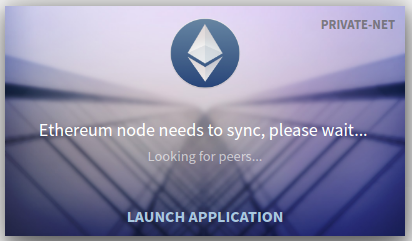
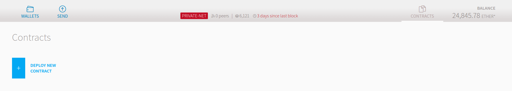
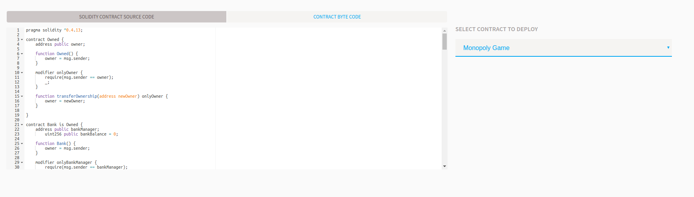
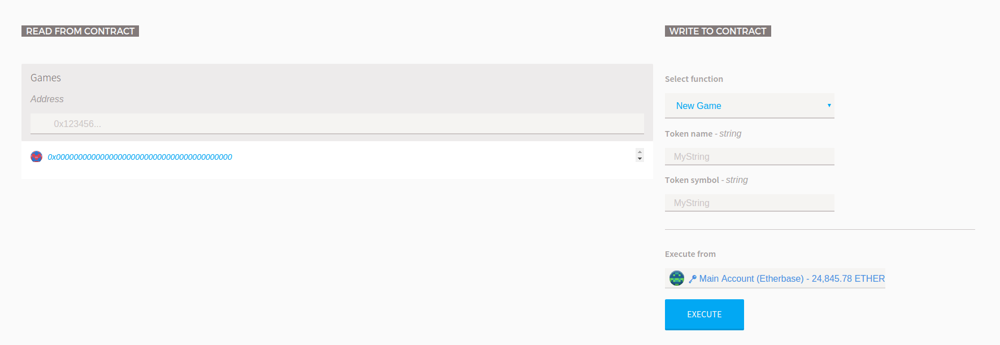
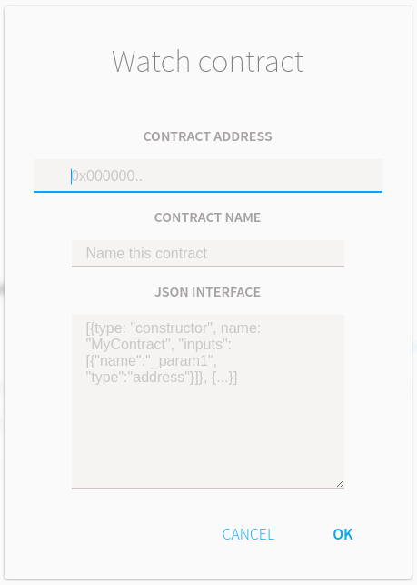

# Blockchain Tech Session #

## Requirements ##

Don't use the .deb if your are on Ubuntu, I had some issue starting a private node with it. Probably a PEBCAC issue :)

* Nodejs + npm
* Geth + Tools [Link](https://geth.ethereum.org/downloads/)
* Wallet [Link](https://github.com/ethereum/mist/releases)

Nice to haves:
* VSCode + Solidity plugin

Tools
* Contract interface generator [Link](http://chriseth.github.io/browser-solidity/#version=soljson-latest.js)

-----
## Starting a development Ethereum blockchain ##

This is a handy way to start an Ethereum sandbox you can test and play in. The `--dev` flags does a bit of setup in the background to create a temporary private Ethereum blockchain 'instance'.

Start a dev ethereum node:
```sh
$ git clone https://github.com/phzietsman/blockchain-monopoly.git
$ cd blockchain-monopoly
$ mkdir downloads
$ cd downloads
$ cp your_download_directory/geth geth 
$ cp your_download_directory/wallet wallet 
$ ./geth --rpc --nat none --dev
```
Look for the following line after the node has started:

`IPC endpoint opened: your_ipc_endpoint`

Start an interactive wallet and client, hooked up to your local running node:
```sh
$ ./wallet --rpc your_ipc_endpoint
$ ./geth attach ipc:your_ipc_endpoint
```

Using the interactive client (Javascript console), create an account and start your miner:
```sh
> personal.newAccount()
> miner.setEtherbase(personal.listAccounts[0]) 
> miner.start()
> eth.getBalance(personal.listAccounts[0])
```

----
## Starting a PRIVATE Ethereum blockchain ##

[Official Resource](https://github.com/ethereum/go-ethereum/wiki/Private-network)

Other less official resources on creating a private network
* [The Good](https://media.consensys.net/how-to-build-a-private-ethereum-blockchain-fbf3904f337)
* [The Bad](https://souptacular.gitbooks.io/ethereum-tutorials-and-tips-by-hudson/content/private-chain.html)
* [The Ugly](https://omarmetwally.wordpress.com/2017/07/25/how-to-create-a-private-ethereum-network/)

### Genesis block ###

First you need a genesis block. This will be the first block in your blockchain and other networks / blockchains with a different genesis block will not sync with this private one. Especially take note of the `chainId`, we will be using it later in the startup of our nodes.
 

```json
{
  "config": {
    "chainId": 123,
    "homesteadBlock": 0,
    "eip155Block": 0,
    "eip158Block": 0
  },
  "nonce": "0x0000000000000045",
  "timestamp": "0x0",
  "parentHash": "0x0000000000000000000000000000000000000000000000000000000000000000",
  "gasLimit": "0x8900000",
  "difficulty": "0x400",
  "mixhash": "0x0000000000000000000000000000000000000000000000000000000000000000",
  "coinbase": "0xdefault_account",
  "alloc": {
    "0xdefault_account" : {"balance" : "10000000000000000000"} 
  }
}
```

> **Ignore for now**
>
> <span style="color:red">I have not dug into this, but it feels like the chicken and  the egg problem.</span>
> Create a default account, this account will be seeded with ether in the genesis 
> block. On a private network this is not important since mining is easy and your earn  ether pretty quickly.
> 
> ```sh
> $./geth account new
> ```

### Starting your nodes ###
**Each node in the network should use the same genesis block / json file to setup their node**

To create a database that uses this genesis block, run the following command. This will import and set the canonical genesis block for your chain.

```sh
$ ./geth --datadir blockchaindata init "../genesis.json"
```

Future runs of geth on this data directory will use the genesis block you have defined. 

>**Note** the networkid matches the chainId in the genesis block. The main ethereum network uses chainId=1. The --identity flag simply gives your node a friendly name, this is not required.

```sh
$ ./geth --datadir blockchaindata --identity "MyNodeName" --networkid 123
```

### Network Connectivity ###
For nodes to discover each other, you need a bootnode (one of the tools in the Ethereum toolbox). This node needs to be reachable by all the nodes you want to connect together. It is possible to run network without a peer node, if you know the `enode` address of someone in the network.

```sh
$ bootnode --genkey=boot.key
$ bootnode --nodekey=boot.key
```

Connecting your peer nodes to the network:

```sh
$ ./geth --datadir blockchaindata --networkid 123 --bootnodes bootnode_enode_url_from_above
```

Notice when you start up a node the console will print out your node's own enode url, this can be used by other nodes to connect to the network.  To add a static node to your config, you can add in one of two ways.  Adding it to `blockchaindata/static-nodes.json` (this should be the same folder that your chaindata and keystore folders are in):

```json
[
  "enode://f4642fa65af50cfdea8fa7414a5def7bb7991478b768e296f5e4a54e8b995de102e0ceae2e826f293c481b5325f89be6d207b003382e18a8ecba66fbaf6416c0@33.4.2.1:30303",
  "enode://pubkey@ip:port"
]
``` 

Or using the JavaScript console, using `admin.addPeer()`:

```sh
> admin.addPeer("enode://f4642fa65af50cfdea8fa7414a5def7bb7991478b768e296f5e4a54e8b995de102e0ceae2e826f293c481b5325f89be6d207b003382e18a8ecba66fbaf6416c0@33.4.2.1:30303")
```

### Mining on a PRIVATE network ###

In a private network, a single CPU miner instance is more than enough for practical purposes as it can produce a stable stream of blocks at the correct intervals without needing heavy resources (consider running on a single thread, no need for multiple ones either). To start a Geth instance for mining, run it with all your usual flags, extended by:

*This is buggy >>*

```sh
$ ./geth <usual-flags> --mine --minerthreads=1 --etherbase=your_eth_account
```
Which will start mining bocks and transactions on a single CPU thread, crediting all proceedings to the account specified by --etherbase. You can further tune the mining by changing the default gas limit blocks converge to (--targetgaslimit) and the price transactions are accepted at (--gasprice).

>**Note** 
>I had some issue to get my miner to run via the commandline args, but the JavaScript console with Mist worked just fine.

Open Mist and create a new account:
```sh
$ ./wallet --rpc your_ipc_endpoint
```

In the JavaScript console, start your miner.

```sh
> miner.setEtherbase(your_address_from_mist) 
> miner.start(1)
```

You will notice after you start your miner it will start to build a [DAG](https://github.com/ethereum/wiki/wiki/Ethash-DAG). This first needs to finish before you will actually start mining Ether. To check your Ether balance using the JavaScript console:

```sh
> eth.getBalance(your_address_from_mist)
```

### Network Connectivity, again ###

To check how many peers the client is connected to in the interactive console, the net module has two attributes give you info about the number of peers and whether you are a listening node.

```sh
> net.listening
true
> net.peerCount
4
```
To get more information about the connected peers, such as IP address and port number, supported protocols, use the peers() function of the admin object. admin.peers() returns the list of currently connected peers.

```sh
> admin.peers
[{
  ID: 'a4de274d3a159e10c2c9a68c326511236381b84c9ec52e72ad732eb0b2b1a2277938f78593cdbe734e6002bf23114d434a085d260514ab336d4acdc312db671b',
  Name: 'Geth/v0.9.14/linux/go1.4.2',
  Caps: 'eth/60',
  RemoteAddress: '5.9.150.40:30301',
  LocalAddress: '192.168.0.28:39219'
}, {
  ID: 'a979fb575495b8d6db44f750317d0f4622bf4c2aa3365d6af7c284339968eef29b69ad0dce72a4d8db5ebb4968de0e3bec910127f134779fbcb0cb6d3331163c',
  Name: 'Geth/v0.9.15/linux/go1.4.2',
  Caps: 'eth/60',
  RemoteAddress: '52.16.188.185:30303',
  LocalAddress: '192.168.0.28:50995'
}, {
  ID: 'f6ba1f1d9241d48138136ccf5baa6c2c8b008435a1c2bd009ca52fb8edbbc991eba36376beaee9d45f16d5dcbf2ed0bc23006c505d57ffcf70921bd94aa7a172',
  Name: 'pyethapp_dd52/v0.9.13/linux2/py2.7.9',
  Caps: 'eth/60, p2p/3',
  RemoteAddress: '144.76.62.101:30303',
  LocalAddress: '192.168.0.28:40454'
}, {
  ID: 'f4642fa65af50cfdea8fa7414a5def7bb7991478b768e296f5e4a54e8b995de102e0ceae2e826f293c481b5325f89be6d207b003382e18a8ecba66fbaf6416c0',
  Name: '++eth/Zeppelin/Rascal/v0.9.14/Release/Darwin/clang/int',
  Caps: 'eth/60, shh/2',
  RemoteAddress: '129.16.191.64:30303',
  LocalAddress: '192.168.0.28:39705'
} ]
```

To check the ports used by geth and also find your enode URI run:
```sh
> admin.nodeInfo
{
  Name: 'Geth/v0.9.14/darwin/go1.4.2',
  NodeUrl: 'enode://3414c01c19aa75a34f2dbd2f8d0898dc79d6b219ad77f8155abf1a287ce2ba60f14998a3a98c0cf14915eabfdacf914a92b27a01769de18fa2d049dbf4c17694@[::]:30303',
  NodeID: '3414c01c19aa75a34f2dbd2f8d0898dc79d6b219ad77f8155abf1a287ce2ba60f14998a3a98c0cf14915eabfdacf914a92b27a01769de18fa2d049dbf4c17694',
  IP: '::',
  DiscPort: 30303,
  TCPPort: 30303,
  Td: '2044952618444',
  ListenAddr: '[::]:30303'
}
```

The `[::]` is a short hand for localhost / 127.0.0.1.


-----

# Blockchain Monopoly #

## Monopoly Guidelines ##
* 8 players (Battleship, Boot, Scottie, Iron, Racecar, Hat, Thimble, Wheelbarrow)
* Total money in circulation: **$15140**
* Each player receives **$1500** before round one
* Bank owns all the property at the start, players buy property from the bank
* Bank owns all the money at the start of the game
* The bank pays each player **$200** everytime they pass **Start**
* Fines gets paid in a **Fines Pool**  and is not owned by anybody
* Claiming the money in the **Fines Pool** needs another player / all the player's consensus
* Players pay 'Rent' to each other when landing on an owned property   

To simplify the game, the token owner controls the bank.  This can be a player or an external party. A more betterer solution would be to remove the bank owner with claims against the bank which gets approved by the other players.


## Application "design" ##
### The Contracts ###
The application will be split up into multiple contracts, it is neccesary for this use case, but it is fun.

```javascript
contract Owned {
  /*
    This contract will be used to assign an owner to other cotracts
    and make the execution of certain functions privileged
  */
}

```
```javascript
contract Bank {
  /*
    This will function much the same as the Owned contract, but can have a different
    controlling address assigned to it. It will also have a 'bank balance' 
  */
}

```
```javascript
contract MonopolyGame {
  /*
    This a contract that creates contracts. When ever someone other than the contract 
    owner wants to play monopoly, they can run this contract and they will get their own "instance"
    of monopoly. This can be compared to buying a copy of a game.
  */
}
```
```javascript
contract MonopolyBank is Owned, Bank {
  /*
    The actual monopoly game bank.
    MonopolyBank will be derived from Bank and Owned and will have access to their funtions
  */
}
```
### Modifiers ###
A modifier are a special type of function that can be called before the function is executed and modify the behaviour of the function, we will build 3 modifiers:
* onlyOwner
* onlyBankManager
* onlyPlayers

### Modifiers ###
Game owner functions
* NewGame()
* SetPlayer(string, address)
* BankPayPlayer(string, int)
* RefundBank()

### Deploying the contracts ###
We will be deploying via mist, although this can be done using truffle.js which is a MUCH better way to do it.

1. Ensure your node, miner (not required when cnnected to a network) and mist is running
2. Make sure mist is running a private-net, otherwise the main Ethereum blockchain will start to sync to your PC 



3. Open mist and go to the contracts section and click on **DEPLOY NEW CONTRACT** button 



4. To deploy, copy the code in the `monopoly_dao.sol` file (in the contracts folder) into the code editing area and select to deploy the **Monopoly Game** contract



5. The contract will take a while to deploy, but once deploy it should sit under your list of contracts.

**To start a monopoly bank**
 
 1. Run the monopoly game contract (give it a name and currency symbol)



 2. After the contract has executed, there should be an entry in the list of created games for your account's address
 3. Memorize or copy this entry (also an address)
 4. Go to the contracts page and **WATCH a CONTRACT**



 5. Enter the entry you cpoied into the address field and give it a name
 6. Copy the content from the `MonopolyBank.json` file into the interface section and click OK
 7. Start playing monopoly 

### Other Stuff ###
* `mapping` types are declared as `mapping(_KeyType => _ValueType)`. Here `_KeyType` can be almost any type except for a mapping, a dynamically sized array, a contract, an enum and a struct. `_ValueType` can actually be any type, including mappings.
* mappings with a _KeyType `string` cannot be made public, since there is no accesor for it. You probably could write one yourself. I did not.
* Writing to storage is an expensive exercise


